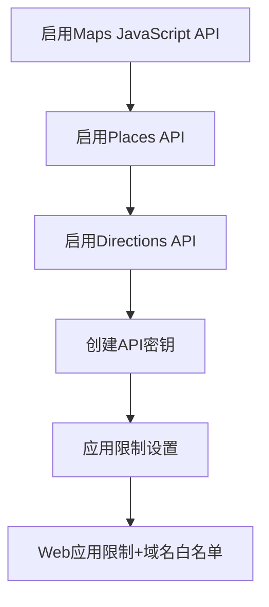
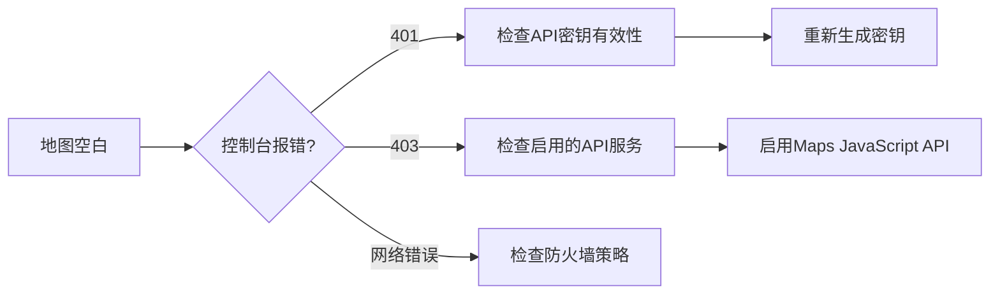

### 一、API密钥配置（生产级安全实践）

1. **创建环境变量文件**

```bash
# .env.local
NEXT_PUBLIC_GOOGLE_MAPS_API_KEY=your_actual_key_here
```

2. **Google Cloud控制台设置**



3. **密钥安全防护**

```javascript
// next.config.js
module.exports = {
  async headers() {
    return [
      {
        source: '/(.*)',
        headers: [
          {
            key: 'X-Content-Type-Options',
            value: 'nosniff'
          }
        ],
      },
    ]
  }
}
```

### 二、地图组件基础实现

1. **安装核心依赖**

```bash
yarn add @react-google-maps/api @types/google.maps
```

2. **创建动态加载的地图组件**

```tsx
// components/MapContainer.tsx
'use client';

import { GoogleMap, useJsApiLoader, Marker } from '@react-google-maps/api';
import { memo, useCallback, useState } from 'react';

const DEFAULT_CENTER = { lat: 31.2304, lng: 121.4737 }; // 上海坐标
const DEFAULT_ZOOM = 12;

const MapContainer = memo(() => {
  const { isLoaded } = useJsApiLoader({
    id: 'google-map-script',
    googleMapsApiKey: process.env.NEXT_PUBLIC_GOOGLE_MAPS_API_KEY || '',
    libraries: ['places']
  });

  const [map, setMap] = useState<google.maps.Map | null>(null);

  const onLoad = useCallback((map: google.maps.Map) => {
    const bounds = new window.google.maps.LatLngBounds(DEFAULT_CENTER);
    map.fitBounds(bounds);
    setMap(map);
  }, []);

  const onUnmount = useCallback(() => {
    setMap(null);
  }, []);

  if (!isLoaded) return <div>Loading...</div>;

  return (
    <div className="h-[600px] w-full">
      <GoogleMap
        mapContainerClassName="w-full h-full"
        center={DEFAULT_CENTER}
        zoom={DEFAULT_ZOOM}
        onLoad={onLoad}
        onUnmount={onUnmount}
      >
        {/* 示例标记点 */}
        <Marker 
          position={DEFAULT_CENTER} 
          title="起点"
          icon={{
            url: '/marker-start.png',
            scaledSize: new window.google.maps.Size(32, 32)
          }}
        />
      </GoogleMap>
    </div>
  );
});

export default dynamic(() => Promise.resolve(MapContainer), { 
  ssr: false 
});
```

### 三、关键实现细节

1. **性能优化技巧**

```typescript
// 使用debounce处理地图事件
const debouncedHandler = _.debounce((map: google.maps.Map) => {
  const center = map.getCenter();
  console.log('Current center:', center?.lat(), center?.lng());
}, 300);

// 地图事件监听
useEffect(() => {
  if (!map) return;
  
  const listener = map.addListener('dragend', () => debouncedHandler(map));
  return () => google.maps.event.removeListener(listener);
}, [map]);
```

2. **标记点管理方案**

```tsx
// 使用Context管理标记点状态
type MarkerType = {
  id: string;
  position: google.maps.LatLngLiteral;
  type: 'start' | 'end' | 'waypoint';
};

const MapContext = createContext<{
  markers: MarkerType[];
  addMarker: (marker: Omit<MarkerType, 'id'>) => void;
  removeMarker: (id: string) => void;
}>(null!);

// 动态图标加载
const getMarkerIcon = (type: MarkerType['type']) => {
  const icons = {
    start: '/marker-start.png',
    end: '/marker-end.png',
    waypoint: '/marker-waypoint.png'
  };
  return {
    url: icons[type],
    scaledSize: new google.maps.Size(32, 32)
  };
};
```

### 四、常见问题解决方案

1. **地图加载失败排查流程**



2. **内存泄漏预防**

```typescript
// 使用cleanup函数
useEffect(() => {
  let isMounted = true;
  const listener = map?.addListener('click', (e: google.maps.MapMouseEvent) => {
    if (isMounted) {
      handleMapClick(e);
    }
  });

  return () => {
    isMounted = false;
    if (listener) {
      google.maps.event.removeListener(listener);
    }
  };
}, [map]);
```

### 五、扩展准备（为路径规划功能铺垫）

1. **方向服务预配置**

```tsx
// 在MapContainer中添加DirectionsService和DirectionsRenderer
const [directions, setDirections] = useState<google.maps.DirectionsResult>();

<>
  <DirectionsService
    options={{
      destination: endPoint,
      origin: startPoint,
      travelMode: google.maps.TravelMode.DRIVING
    }}
    callback={(result, status) => {
      if (status === 'OK') {
        setDirections(result);
      }
    }}
  />

  {directions && (
    <DirectionsRenderer
      options={{
        directions,
        suppressMarkers: true
      }}
    />
  )}
</>
```

建议采用渐进式加载策略：首次加载时仅初始化地图核心功能，路径规划相关组件按需动态加载。使用Suspense边界包裹地图组件，同时显示加载骨架屏：

```tsx
<Suspense fallback={<MapSkeleton />}>
  <MapContainer />
</Suspense>
```
