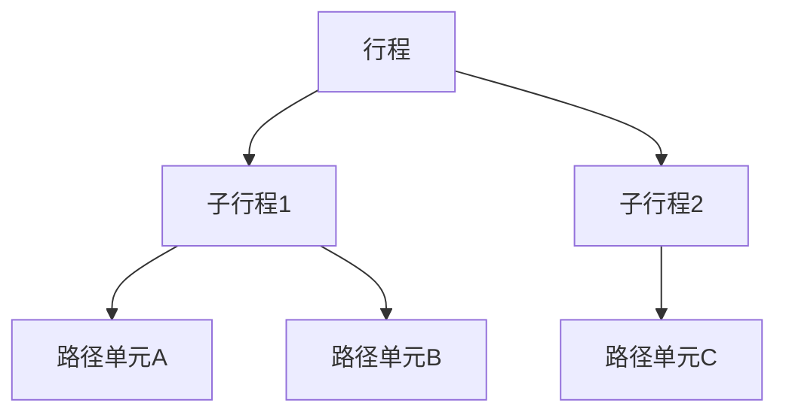
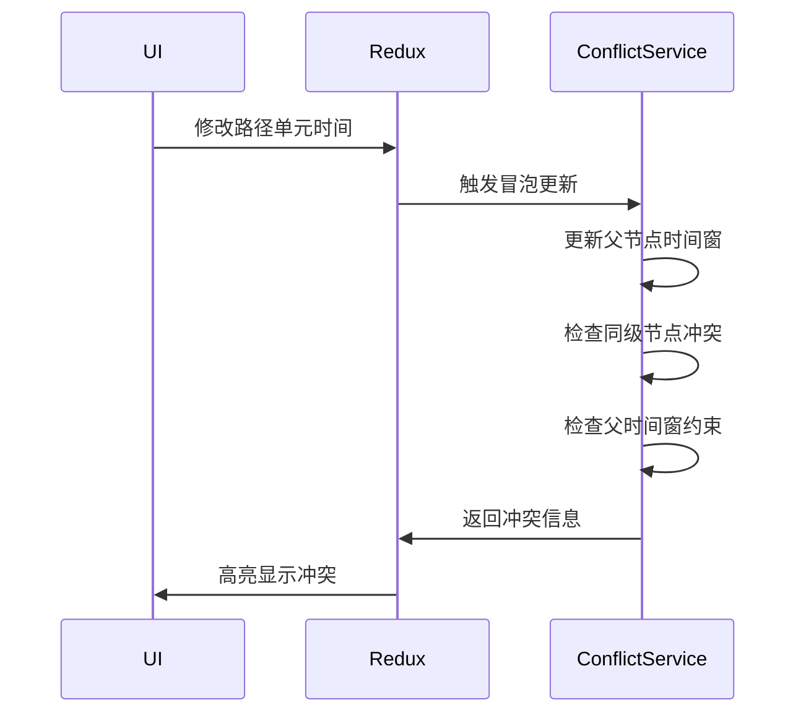

根据需求，设计树形行程结构和时间窗模型如下：

### 一、树形行程结构 JSON Schema

```json
{
  "$schema": "http://json-schema.org/draft-07/schema#",
  "definitions": {
    "TimeWindow": {
      "type": "object",
      "properties": {
        "start": { "type": "string", "format": "date-time" },
        "end": { "type": "string", "format": "date-time" },
        "isFixed": { "type": "boolean" }
      },
      "required": ["start", "end"]
    },
    
    "Cost": {
      "type": "object",
      "properties": {
        "total": { "type": "number" },
        "breakdown": {
          "type": "array",
          "items": {
            "type": "object",
            "properties": {
              "type": { 
                "type": "string",
                "enum": ["transport", "accommodation", "toll"]
              },
              "amount": { "type": "number" }
            }
          }
        }
      }
    },

    "PathUnit": {
      "type": "object",
      "properties": {
        "id": { "type": "string" },
        "type": { "const": "pathUnit" },
        "name": { "type": "string" },
        "startLocation": { "$ref": "#/definitions/GeoPoint" },
        "endLocation": { "$ref": "#/definitions/GeoPoint" },
        "transportationMode": {
          "type": "string",
          "enum": ["walking", "driving", "public_transport"]
        },
        "timeWindow": { "$ref": "#/definitions/TimeWindow" },
        "cost": { "$ref": "#/definitions/Cost" },
        "status": {
          "type": "string",
          "enum": ["normal", "conflict", "optimizing"]
        }
      },
      "required": ["id", "type"]
    },

    "Itinerary": {
      "type": "object",
      "properties": {
        "id": { "type": "string" },
        "type": { "const": "itinerary" },
        "name": { "type": "string" },
        "children": {
          "type": "array",
          "items": {
            "oneOf": [
              { "$ref": "#/definitions/Itinerary" },
              { "$ref": "#/definitions/PathUnit" }
            ]
          }
        },
        "timeWindow": { "$ref": "#/definitions/TimeWindow" },
        "cost": { "$ref": "#/definitions/Cost" },
        "status": {
          "type": "string",
          "enum": ["normal", "conflict", "optimizing"]
        }
      },
      "required": ["id", "type"]
    },

    "GeoPoint": {
      "type": "object",
      "properties": {
        "lat": { "type": "number" },
        "lng": { "type": "number" }
      }
    }
  }
}
```

### 二、时间窗对象模型设计

```typescript
interface TimeWindow {
  start: Date;       // 时间窗开始
  end: Date;         // 时间窗结束
  isFixed: boolean;  // 是否用户固定时间
  buffer?: number;   // 弹性缓冲时间（分钟）
  
  // 冲突检测方法
  hasConflict(other: TimeWindow): boolean {
    return this.start < other.end && this.end > other.start;
  }
  
  // 时间窗自动扩展方法
  expandByBuffer() {
    if (!this.isFixed) {
      this.start = new Date(this.start.getTime() - this.buffer * 60_000);
      this.end = new Date(this.end.getTime() + this.buffer * 60_000);
    }
  }
}

// 使用区间树优化冲突检测
class TimeIntervalTree {
  private tree: IntervalTree;
  
  constructor(nodes: ItineraryNode[]) {
    this.tree = new IntervalTree(
      nodes.map(node => ({
        low: node.timeWindow.start.getTime(),
        high: node.timeWindow.end.getTime(),
        data: node
      }))
    );
  }

  findConflicts(node: ItineraryNode): ItineraryNode[] {
    return this.tree
      .search(
        node.timeWindow.start.getTime(),
        node.timeWindow.end.getTime()
      )
      .filter(interval => interval.data.id !== node.id)
      .map(interval => interval.data);
  }
}
```

### 三、核心数据结构特点

1. **递归嵌套结构**：


2. **冒泡更新机制**：
```typescript
function bubbleUpdate(node: ItineraryNode) {
  while (node.parent) {
    node.parent.timeWindow = recalculateTimeWindow(node.parent);
    node.parent.cost = recalculateCost(node.parent);
    node = node.parent;
    
    if (node.timeWindow.isFixed) {
      checkTimeConflict(node);
    }
  }
}
```

3. **动态费用计算**：
```javascript
// 递归计算总费用
function calculateCost(node) {
  if (node.type === 'pathUnit') {
    return node.cost.total;
  }
  return node.children.reduce((sum, child) => sum + calculateCost(child), 0);
}
```

4. **冲突检测流程**：


该设计支持：
- 无限层级嵌套的行程结构
- 时间窗的动态扩展与固定模式
- 基于区间树的O(log n)复杂度冲突检测
- 自动化的费用/时间冒泡更新机制
- 与React DnD拖拽库的无缝集成（通过节点ID维护结构）