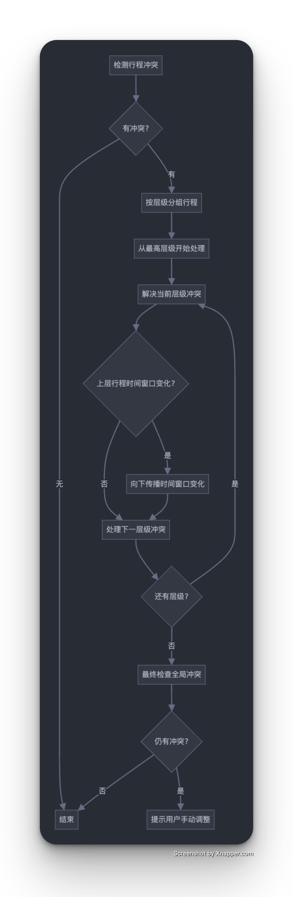

## 1. 优先级驱动的重规划算法

```javascript
function rescheduleTripsByPriority(trips, conflicts) {
  // 按优先级排序（用户设定、重要性或固定性）
  const sortedTrips = [...trips].sort((a, b) => b.priority - a.priority);
  
  // 高优先级行程保持不变，低优先级行程调整
  for (const trip of sortedTrips) {
    if (!conflicts.some(c => c.includes(trip.id))) continue;
    
    // 尝试移动时间窗口直到不再有冲突
    rescheduleTrip(trip, getConflictingTrips(trip, sortedTrips));
  }
}
```

**优势**：实现简单，用户可直接控制哪些行程更重要

## 2. 启发式时间窗口调整

此算法根据行程的灵活性评分决定哪个行程需要调整，并处理嵌套行程结构，确保子行程也随之调整。算法采用启发式方法，优先移动灵活性高的行程，并逐步减少冲突数量。

```javascript
interface Trip {
  id: string;
  startTime: Date;
  endTime: Date;
  minDuration: number;  // 最小所需时间（分钟）
  flexibility: number;  // 0-10, 灵活性评分
  children?: Trip[];    // 子行程
  parent?: string;      // 父行程ID
}

interface Conflict {
  tripA: string;
  tripB: string;
  overlapStart: Date;
  overlapEnd: Date;
  overlapDuration: number;
}

// 检测时间冲突
function detectConflicts(trips: Trip[]): Conflict[] {
  const conflicts: Conflict[] = [];
  
  for (let i = 0; i < trips.length; i++) {
    for (let j = i + 1; j < trips.length; j++) {
      const tripA = trips[i];
      const tripB = trips[j];
      
      // 如果是父子关系的行程，允许重叠
      if (tripA.parent === tripB.id || tripB.parent === tripA.id) continue;
      
      // 检查时间重叠
      const overlapStart = new Date(Math.max(tripA.startTime.getTime(), tripB.startTime.getTime()));
      const overlapEnd = new Date(Math.min(tripA.endTime.getTime(), tripB.endTime.getTime()));
      
      if (overlapStart < overlapEnd) {
        const overlapDuration = (overlapEnd.getTime() - overlapStart.getTime()) / (1000 * 60); // 分钟
        conflicts.push({
          tripA: tripA.id,
          tripB: tripB.id,
          overlapStart,
          overlapEnd,
          overlapDuration
        });
      }
    }
  }
  
  return conflicts;
}

// 根据启发式规则重新规划行程
function rescheduleTrips(trips: Trip[], conflicts: Conflict[]): Trip[] {
  if (conflicts.length === 0) return trips;
  
  // 创建副本以避免修改原始数据
  const newTrips = JSON.parse(JSON.stringify(trips));
  const tripsMap = new Map<string, Trip>();
  
  // 构建查找映射
  newTrips.forEach(trip => {
    tripsMap.set(trip.id, trip);
  });
  
  // 处理每个冲突
  conflicts.forEach(conflict => {
    const tripA = tripsMap.get(conflict.tripA)!;
    const tripB = tripsMap.get(conflict.tripB)!;
    
    // 决定哪个行程需要移动（移动灵活性更高的）
    const tripToMove = tripA.flexibility >= tripB.flexibility ? tripA : tripB;
    const fixedTrip = tripToMove === tripA ? tripB : tripA;
    
    // 计算需要移动的时间
    const duration = tripToMove.endTime.getTime() - tripToMove.startTime.getTime();
    
    // 尝试移动到冲突之后
    const newStartTime = new Date(fixedTrip.endTime.getTime() + 5 * 60 * 1000); // 添加5分钟缓冲
    const newEndTime = new Date(newStartTime.getTime() + duration);
    
    // 更新时间
    tripToMove.startTime = newStartTime;
    tripToMove.endTime = newEndTime;
    
    // 递归更新子行程
    if (tripToMove.children && tripToMove.children.length > 0) {
      // 计算时间偏移量
      const timeOffset = newStartTime.getTime() - tripToMove.startTime.getTime();
      shiftChildTrips(tripToMove.children, timeOffset);
    }
  });
  
  // 检查新的冲突并递归处理
  const newConflicts = detectConflicts(newTrips);
  if (newConflicts.length > 0 && newConflicts.length < conflicts.length) {
    // 只有在冲突数量减少时才继续，避免无限循环
    return rescheduleTrips(newTrips, newConflicts);
  }
  
  return newTrips;
}

// 递归移动子行程时间
function shiftChildTrips(trips: Trip[], timeOffset: number): void {
  trips.forEach(trip => {
    trip.startTime = new Date(trip.startTime.getTime() + timeOffset);
    trip.endTime = new Date(trip.endTime.getTime() + timeOffset);
    
    if (trip.children && trip.children.length > 0) {
      shiftChildTrips(trip.children, timeOffset);
    }
  });
}

// 主函数：检测冲突并重新规划
function planAndResolveConflicts(trips: Trip[]): {
  updatedTrips: Trip[],
  resolvedConflicts: boolean,
  remainingConflicts: Conflict[]
} {
  // 扁平化处理所有行程（包括嵌套行程）以便冲突检测
  const flattenedTrips = flattenTrips(trips);
  
  // 检测冲突
  const initialConflicts = detectConflicts(flattenedTrips);
  
  if (initialConflicts.length === 0) {
    return {
      updatedTrips: trips,
      resolvedConflicts: true,
      remainingConflicts: []
    };
  }
  
  // 重新规划
  const rescheduledTrips = rescheduleTrips(trips, initialConflicts);
  const flattenedRescheduled = flattenTrips(rescheduledTrips);
  const remainingConflicts = detectConflicts(flattenedRescheduled);
  
  return {
    updatedTrips: rescheduledTrips,
    resolvedConflicts: remainingConflicts.length === 0,
    remainingConflicts
  };
}

// 扁平化嵌套行程结构
function flattenTrips(trips: Trip[]): Trip[] {
  const result: Trip[] = [];
  
  function traverse(tripList: Trip[]) {
    tripList.forEach(trip => {
      result.push(trip);
      if (trip.children && trip.children.length > 0) {
        traverse(trip.children);
      }
    });
  }
  
  traverse(trips);
  return result;
}
```

## 3. 约束满足问题（CSP）方法

约束满足问题方法将行程调度视为一组时间窗口约束，使用回溯算法找到满足所有约束的解决方案：

```javascript
function scheduleAsCSP(trips) {
  // 将每个行程转换为变量和约束
  const variables = trips.map(trip => ({
    id: trip.id,
    domain: generatePossibleTimeSlots(trip),
    assignedValue: null
  }));
  
  const constraints = generateConstraints(trips);
  
  // 使用回溯搜索找到可行的调度
  return backtrackSearch(variables, constraints);
}
```

**优势**：能够找到全局最优解，处理复杂约束，适合高度约束的行程

## 4. 分层时间窗口调整

这种方法处理嵌套行程的特点，自上而下先调整高层级行程，再处理低层级行程，保持行程层级的完整性。



```
flowchart TD
    A[检测行程冲突] --> B{有冲突?}
    B -->|无| C[结束]
    B -->|有| D[按层级分组行程]
    D --> E[从最高层级开始处理]
    E --> F[解决当前层级冲突]
    F --> G{上层行程时间窗口变化?}
    G -->|是| H[向下传播时间窗口变化]
    G -->|否| I[处理下一层级冲突]
    H --> I
    I --> J{还有层级?}
    J -->|是| F
    J -->|否| K[最终检查全局冲突]
    K --> L{仍有冲突?}
    L -->|是| M[提示用户手动调整]
    L -->|否| C
```

## 5. 遗传算法优化

对于大量行程和复杂约束，遗传算法可以搜索近似最优解：

```javascript
function geneticOptimization(trips, conflicts) {
  // 初始化种群（多个可能的行程安排）
  const population = initializePopulation(trips, populationSize);
  
  for (let generation = 0; generation < maxGenerations; generation++) {
    // 评估适应度（冲突最少，时间变动最小）
    const fitness = evaluatePopulation(population);
    
    // 选择、交叉和变异
    const selected = selection(population, fitness);
    const offspring = crossover(selected);
    mutate(offspring);
    
    // 形成新一代
    population = [...elitism(population, fitness), ...offspring];
    
    // 检查是否找到无冲突解决方案
    const bestSolution = getBestSolution(population, fitness);
    if (getConflicts(bestSolution).length === 0) {
      return bestSolution;
    }
  }
  
  return getBestSolution(population, evaluatePopulation(population));
}
```

**优势**：适合大规模复杂场景，能找到近似最优解，易于加入多目标优化（如最小化时间变动）

## 实现建议

根据您的技术栈和应用特点，我推荐采用以下实现策略：

1. **基础实现**：从启发式时间窗口调整算法开始，它实现简单且能满足大部分场景
2. **进阶实现**：
   - 集成优先级系统，允许用户标记重要行程
   - 添加分层处理逻辑处理嵌套行程
   - 对于复杂场景，考虑添加基于约束的优化

## 技术整合

将算法与您的技术栈整合：

```typescript
// Redux Slice 示例
const tripPlannerSlice = createSlice({
  name: 'tripPlanner',
  initialState,
  reducers: {
    addTrip: (state, action) => {
      // 添加行程
      state.trips.push(action.payload);
      // 检测并解决冲突
      const { conflicts, updatedTrips } = detectAndResolveConflicts(state.trips);
      state.trips = updatedTrips;
      state.conflicts = conflicts;
    },
    // 其他行程操作...
  }
});
``` 

