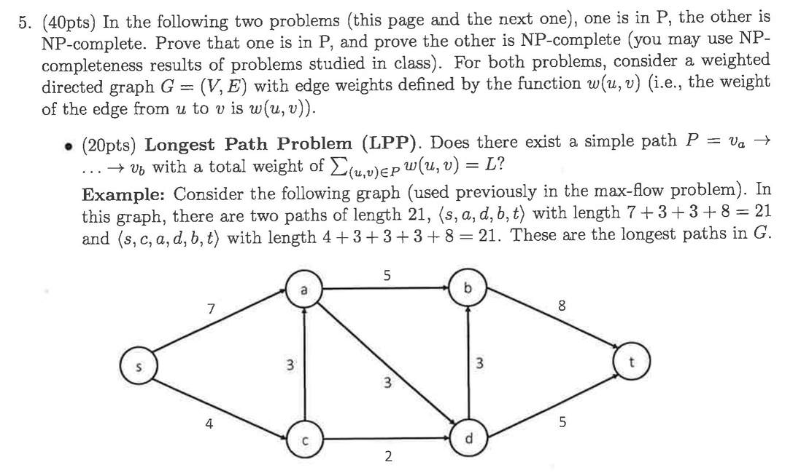
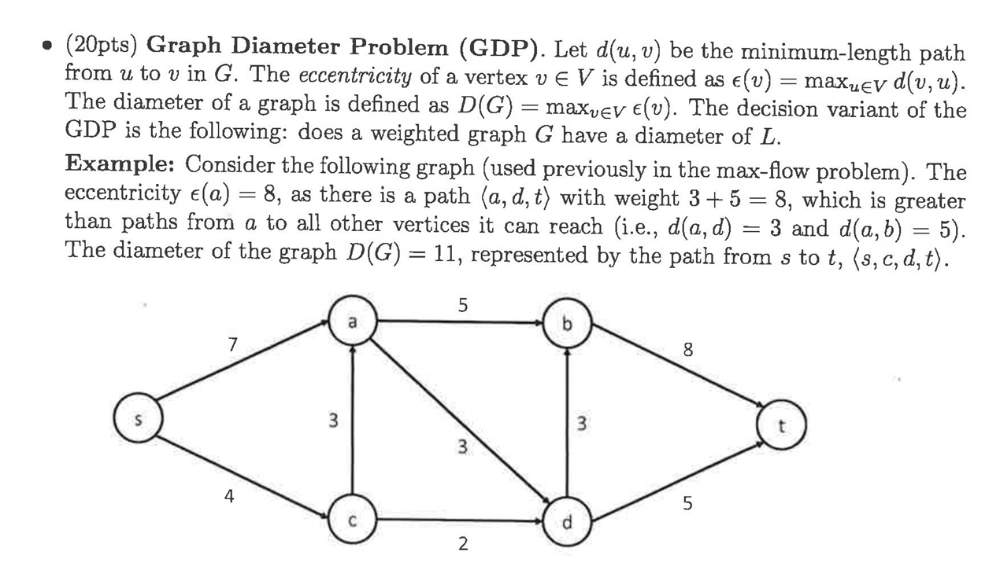

I'll analyze both problems and prove which one is in P and which is NP-complete.

# Proof that GDP is in P

The Graph Diameter Problem (GDP) can be solved in polynomial time:

1. **Problem definition**: Determine if a weighted graph G has a diameter of L, where:
   - d(u,v) = minimum-length path from u to v
   - ε(v) = max_{u∈V} d(v,u) (eccentricity of vertex v)
   - D(G) = max_{v∈V} ε(v) (diameter of graph)

2. **Polynomial-time algorithm**:
   - Use the Floyd-Warshall algorithm to compute all-pairs shortest paths in O(V³) time
   - For each vertex v, compute its eccentricity ε(v) = max_{u∈V} d(v,u) in O(V) time
   - Find the maximum eccentricity (diameter) D(G) = max_{v∈V} ε(v) in O(V) time
   - Compare D(G) with L

3. **Time complexity**: O(V³), which is polynomial in the input size

Therefore, GDP is in P.

# Proof that LPP is NP-complete

The Longest Path Problem (LPP) asks if there exists a simple path from v_a to v_b with total weight L.

1. **LPP is in NP**:
   - Given a candidate path P, we can verify in polynomial time that:
     - P is a simple path (no repeated vertices)
     - P starts at v_a and ends at v_b
     - The total weight of P equals L

2. **LPP is NP-hard**:
   - I'll reduce from the Hamiltonian Path problem, which is known to be NP-complete
   - Given an instance of the Hamiltonian Path problem with graph G = (V,E), source s, and target t
   - Create an instance of LPP with:
     - Same graph G, with weight w(u,v) = 1 for each edge
     - Source vertex v_a = s
     - Destination vertex v_b = t
     - Target weight L = |V|-1
   - A Hamiltonian Path exists in G if and only if there exists a simple path from s to t with weight |V|-1
   - This reduction can be done in polynomial time

Since LPP is both in NP and NP-hard, it is NP-complete.

The key difference between these problems is that LPP asks for a specific type of path (longest) between two vertices, which is inherently hard (NP-complete), while GDP asks about the maximum of minimum distances (shortest paths), which can be computed efficiently (in P).
