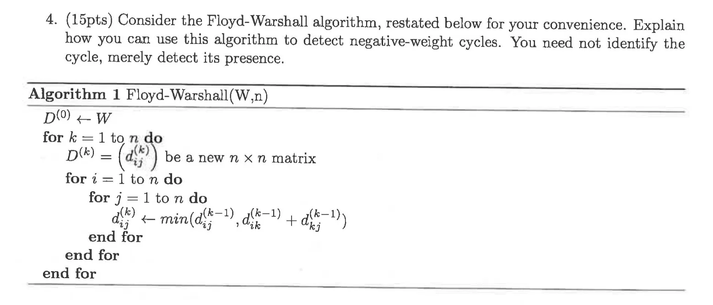

# Using Floyd-Warshall to Detect Negative Weight Cycles

The Floyd-Warshall algorithm computes the shortest paths between all pairs of vertices in a weighted directed graph. We can leverage this algorithm to detect negative weight cycles with a simple modification.

## The Key Insight

A negative weight cycle exists in a graph if and only if there is at least one vertex whose distance to itself is negative. This is because:

1. In a graph with no negative cycles, the shortest path from any vertex to itself should be 0 (by not moving at all).
2. If a negative cycle exists, then a vertex on that cycle can reach itself with a negative total weight by traversing the cycle.

## Modified Approach

To detect negative weight cycles using the Floyd-Warshall algorithm:

1. Run the standard Floyd-Warshall algorithm as shown in the pseudocode.
2. After the algorithm completes, examine the diagonal elements of the final distance matrix D^(n).
3. If any d_ii^(n) < 0, then a negative weight cycle exists in the graph.

## Why This Works

The Floyd-Warshall algorithm computes d_ij^(k), which represents the shortest path from vertex i to vertex j using only vertices {1, 2, ..., k} as intermediate vertices.

After the algorithm completes (k = n), d_ij^(n) represents the shortest path from vertex i to vertex j using any vertices in the graph as intermediates.

For any vertex i, d_ii^(n) should be 0 if there are no negative cycles. However, if d_ii^(n) < 0, it means vertex i can reach itself with a path of negative weight, which implies the existence of a negative weight cycle.

## Implementation

```
Function DetectNegativeCycle(W, n):
    // Run standard Floyd-Warshall algorithm
    D^(0) ← W
    for k = 1 to n do
        D^(k) = new n × n matrix
        for i = 1 to n do
            for j = 1 to n do
                d_ij^(k) ← min(d_ij^(k-1), d_ik^(k-1) + d_kj^(k-1))
            end for
        end for
    end for
    
    // Check diagonal elements for negative values
    for i = 1 to n do
        if d_ii^(n) < 0 then
            return TRUE  // Negative cycle detected
        end for
    return FALSE  // No negative cycle
```

This approach efficiently detects negative weight cycles in O(V³) time without needing to explicitly identify the cycle itself.
